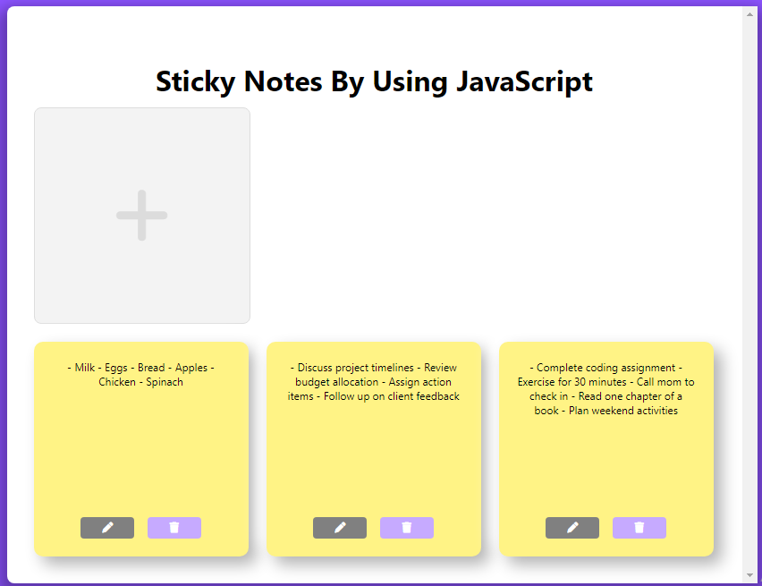

# Sticky Notes Web App

Welcome to the Sticky Notes Web App repository! This project provides a simple yet effective way to manage your tasks, ideas, or reminders through digital sticky notes directly in your web browser.

## Features

- **Create Notes**: Easily add new sticky notes with customizable text to jot down your thoughts or to-do items.
- **Edit Notes**: Modify the content of your existing notes whenever needed.
- **Delete Notes**: Remove any unwanted notes from your list with just a click.
- **Local Storage**: Your notes are securely stored locally in your browser, ensuring they remain accessible across sessions.

## Usage

1. **Clone the Repository**: Start by cloning the repository to your local machine using the provided Git URL.

2. **Open the Web App**: Simply open the `index.html` file in your preferred web browser to access the Sticky Notes Web App.

3. **Interact with Notes**: To add a new note, click on the plus icon in the header. You can then edit or delete existing notes by clicking on the respective icons next to each note.

## Contributing

Contributions to this project are highly appreciated! If you have any ideas for improvements or new features, feel free to submit a pull request. Be sure to follow the guidelines outlined in the [contributing guidelines](CONTRIBUTING.md).

## License

This project is licensed under the [MIT License](LICENSE), allowing for free and open use, modification, and distribution.

()
